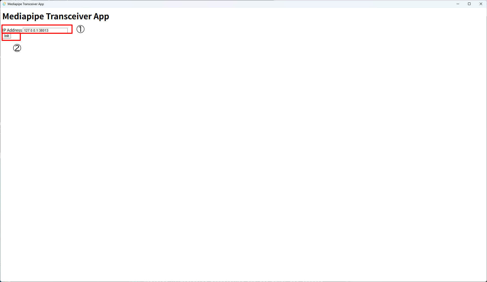
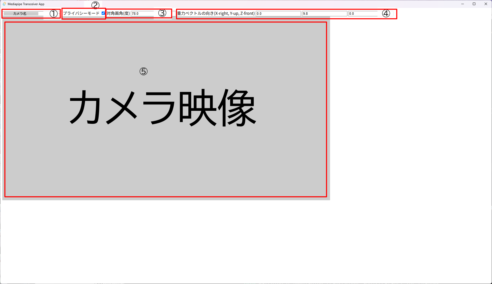

# Mediapipe HolisticLandmarker Tauri版

- Author: Hiroaki Yaguchi, 947d-tech
- License: Apache-2.0 (mediapipeに準拠)

claudeとのペアプログラミングによって作成しています。
描画部分は公式サンプルコードを参考にしています。
https://github.com/google-ai-edge/mediapipe-samples-web/blob/main/src/tasks/holistic-landmarker.ts

## 使用方法

webカメラをPCに接続してください。

起動すると次の画面が表示されます。



①に送信先IPアドレスとポート番号を入力してください。
同じマシン内で送信する場合はそのまま(127.0.0.1:38013)にしてください。
異なるマシンへ送信する場合はIPアドレスを書き換えてください。
HIROMEIROではポート番号は38013(0x947d)を使用します。

②Initボタンを押すと認識画面に遷移します。



認識画面を開いた初回ではカメラへのアクセスを許可する必要があります。
ダイアログから許可を行ってください。

①のドロップダウンメニューから使用するカメラを選択してください。

②には、カメラの対角画角を入力します。
使用するカメラのカタログスペックから引用して下さい。

③には、カメラの向きを指定する重力ベクトルを入力します。
座標系はX-right Y-up Z-frontで、
重力ベクトルは鉛直上向きとなります。

- カメラ映像の下が床方向を向いている場合、重力ベクトルは(0, 9.8, 0)となります。
- カメラ映像の左を床方向に向けた場合、重力ベクトルは(9.8, 0, 0)となります。

④に認識結果を表示します。
入力映像が表示されますので、
配信画面に映りこまないよう十分に注意してください。

## 開発者向け・ビルド方法

nodejs, rustおよびtauriをインストールしてください。

npmで必要なパッケージをインストールします。

```
npm install
```

モデルファイルをダウンロードします。

```
npm run download:model
```

javascriptのソースを変換します。

```
npx webpack
```

デバッグモードでコンパイルし実行します。

```
cargo tauri dev
```

リリースモードでコンパイルする場合は以下を実行して下さい。

```
cargo tauri build
```
